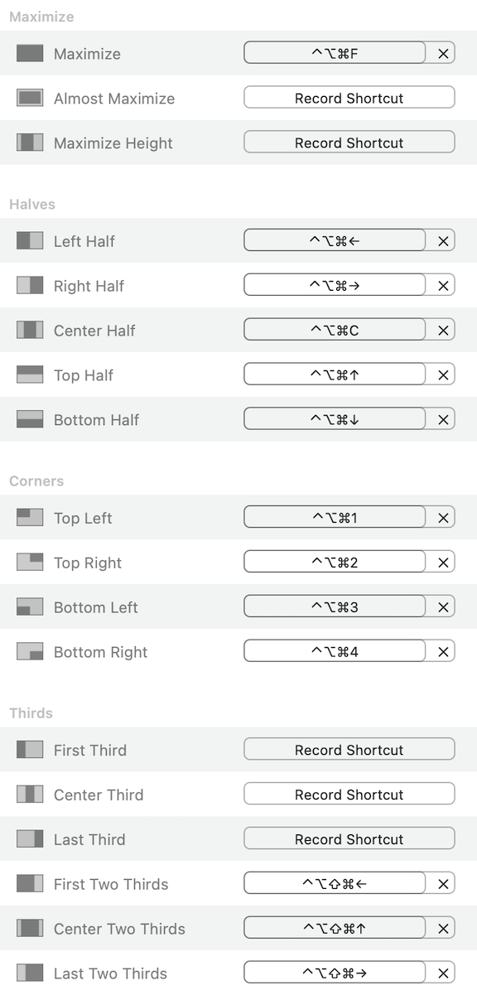

# Dygma Raise Layouts

These layouts focus on adding shortcuts rather than moving around existing keys.

For example, I'm too old to be moving around backspace and enter even though those are one of the most popular mods. One exception is that I did remove caps-lock, move escape to caps, and using escape as backtick.

---

macros:
- 2. lockl screen
screen capture
vs-terminal
vs-last-edit
end-enter
self
open-slack
open- vs code
open github desktop
open bear
open chrome
end of line
end-colon-enter
up-five-lines
16. down-five-lines
00
000
vs fold
vs unfold
vs debug current-test
space=space
23. enterup
no name
no name
.....

Layer 2 - N key | CTRL + - | Go back (VS Code Shortcut) 
Layer 2 - M key | CTRL + Shift + - | Go Foward (VS Code Shortcut) 

Layer 3 - K key | CMD + ALT + K | Toggle Bookmark (VS Code Shortcut)
Layer 3 - J key | CMD + ALT + J | Go to last Bookmark (VS Code Shortcut)
Layer 3 - L key | CMD + ALT + L | Go to next Bookmark (VS Code Shortcut)
Layer 3 - R key | Shift F12 | Find all References (VS Code Shortcut)

# Layer 1 - General

## Colors

- `purple`: shortcuts useful when programming
- `green`: navigation 

## Shortcuts

- `end-e`: End-Enter - Useful when you are within parentheses and are finished and need to go to the end of the line and then `enter` to next line.
- `end-c`: End-Colon-Enter - Useful when you are defining a function and are typing within the parentheses and need to go to the end of the line to finish with `:` and then `enter` to next line.

---

# Layer 2 - In-app Navigation & Coding Shortings

## Colors

- light blue keys are shortcuts for visual studio 
- green/purple keys are navigation

## Shortcuts

### Visual Studio Shortcuts (light blue)

- key `;` i.e. `S-F10` - in Visual Studio `shift-F10` is a shortcut to bring up the context menu
- key `\` i.e. `a-c-os-\` - Split Window - manually configured shortcut in VS-code
- `a-c-os-B` - Toggle Breakpoint - manually configured shortcut in VS-code
- `MACRO vs-de`: Debug Current Function
- `MACRO VS-la`: VS Code - Go to Last Edit
- `MACRO VS-te`: VS Code - Toggle/Go-To Terminal
- key `n` i.e. `MACRO VS-un` - unfold code
- key `m` i.e. `MACRO VS-fo` - fold code

### Navigation

- `MACRO up-fi` (`up-five`): move up `5` lines and go to the beginning of the line
- `MACRO down` (`down-five`): move down `5` lines and go to the beginning of the line
- `s-os-[`: go the previous tab (this works in VS Code or chrome, etc.)
- `s-os-]`: go the next tab (this works in VS Code or chrome, etc.)
- `Lock 10`: goes to Layer 10 which is a linux version of layer 1

---

# Layer 4 - Window Placement

- Arrows on the right side of the keyboard move the current window to half the of the screen in the direction of the arrow.
    - left and right arrows can be used to move the window from one monitor to the other if the window is already on the side of the corresponding arrow (e.g. left once moves the window to the left half of the screen, left again moves the window to the monitor to the left if applicable)
- Arrows on the left side of the keyboard move the current window to 2/3s of the screen in the direction of the arrow. The up arrow centers the window using 2/3's of the screen.
- `F`: Full screen
- `C`: Center using one half of the screen.
- `Scree`: Screenshot
- `1`, `2`, `3`, `4`: Move the window to the upper-left corner, upper-right corner, lower-left corner, or lower-right corner, respectively.

Note that these keyboard shortcuts are dependant on [Rectangle Pro](https://rectangleapp.com/pro) and the corresponding settings are shown below.

---

# Layer 5 - NumPad

---
